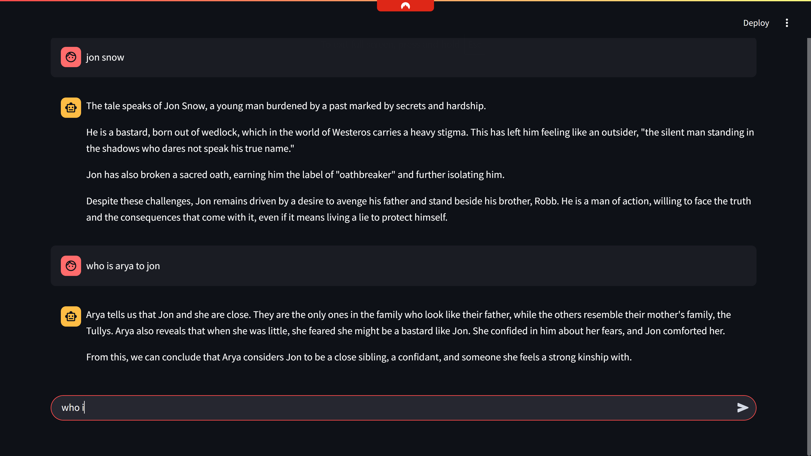

# 📚 Literature CHATBOT — Ask Your Fictional World

A **Streamlit-based conversational assistant** for exploring content from famous novels like *Game of Thrones* and *Sherlock Holmes*. Built with [LangChain](https://www.langchain.com/), [FAISS](https://github.com/facebookresearch/faiss), [Google Generative AI Embeddings](https://ai.google.dev/), [BM25](https://en.wikipedia.org/wiki/Okapi_BM25), and [Cohere Rerank](https://docs.cohere.com/docs/rerank).

---

## ✨ Features

- 🔍 **Hybrid Search**: Combines MMR (FAISS) and BM25 retrieval.
- 🧠 **Cohere Reranking**: Ranks results based on semantic similarity.
- 🧹 **Redundant Chunk Filtering**: Removes duplicate or near-duplicate results.
- 🔄 **Context Reordering**: Arranges content for coherent narrative.
- 📄 **Supports Multiple Novels**: Add PDFs of your favorite books.
- 💬 **Conversational Interface**: Powered by `ChatGroq` + custom prompt for storytelling tone.

---

## 🖼️ Demo Screenshot



---

## 🛠️ Tech Stack

- **Frontend**: Streamlit
- **Embeddings**: Google Generative AI Embeddings (`embedding-001`)
- **Vector Store**: FAISS
- **Retrievers**: FAISS (MMR), BM25, EnsembleRetriever
- **Document Compressors**: Cohere Reranker, Redundancy Filter, Long Context Reorder
- **LLM**: Groq’s Gemma2-9B-IT via `ChatGroq`
- **PDF Parsing**: LangChain's `PyPDFLoader`

---

## 🚀 Getting Started

### 1. Clone the Repo

```bash
git clone https://github.com/Haseeb1511/Literature_Bot_Advance_RAG.git
cd Literature_Bot_Advance_RAG

````

### 2. Install Dependencies

```bash
pip install -r requirements.txt
```

### 3. Setup Environment

Create a `.env` file with:

```
GOOGLE_API_KEY=your_google_api_key
COHERE_API_KEY=your_cohere_api_key
GROQ_API_KEY=your_groq_api_key
```

### 4. Add Your PDFs

Place your novels in:

```
data/got/game of thrones.pdf
data/Sherlock Holmes/cano.pdf
```

You can change the paths in the code if needed.

---

### 5. Run the App

```bash
streamlit run app.py
```

---

## 💡 How It Works

1. **PDFs → Chunks** using LangChain’s recursive splitter.
2. **Embeddings** are generated via Google’s embedding model.
3. **FAISS & BM25** retrievers fetch relevant chunks.
4. **Cohere Reranker + Filter + Reorder** compress the document context.
5. **Groq LLM** answers in a narrative tone using a well-crafted prompt.

---

## 📂 Folder Structure

```
.
├── app.py
├── data/
│   ├── got/
│   │   └── game of thrones.pdf
│   └── Sherlock Holmes/
│       └── cano.pdf
├── .env
└── requirements.txt
```


## ✅ TODO / Improvements

* Add file uploader for dynamic PDF ingestion(later this)
* Add user selection for novel and character(first this step)
* Use persistent FAISS indexing to avoid recomputation

---

## 📝 License

MIT License

---

## 🙌 Acknowledgements

* [LangChain](https://github.com/langchain-ai/langchain)
* [Cohere](https://cohere.com/)
* [Groq](https://console.groq.com/)
* [FAISS](https://github.com/facebookresearch/faiss)

---


